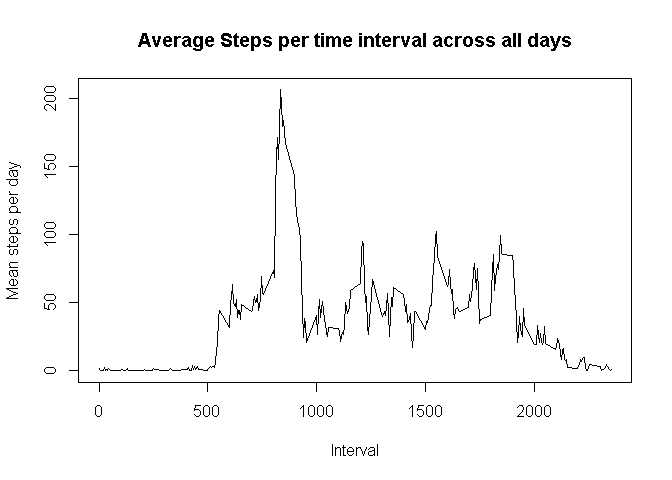
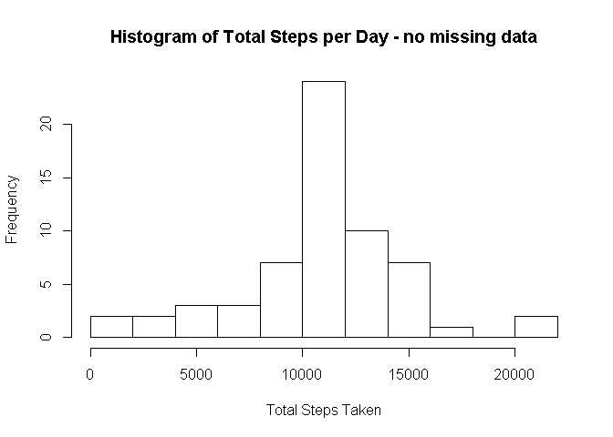

## Loading and preprocessing the data
The following section reads in the data, sets the date format and removes the 'NA' values, creating a reduced data frame "procdata".

```r
library(knitr)
library(dplyr)
```

```
## 
## Attaching package: 'dplyr'
```

```
## The following objects are masked from 'package:stats':
## 
##     filter, lag
```

```
## The following objects are masked from 'package:base':
## 
##     intersect, setdiff, setequal, union
```

```r
library(ggplot2)
unzip("activity.zip",exdir=".",overwrite=TRUE)
rawdata <- read.csv("activity.csv")
rawdata$date <- as.Date(rawdata$date)
procdata <- na.omit(rawdata)
#Total steps per day
totalsteps <- aggregate(procdata$steps,by=list(procdata$date),FUN=sum)
```


## What is mean total number of steps taken per day?
The summary information, including the total number of steps per day is as follows:

```r
#Histogram
par(mfrow=c(1,1))
Plot1 <- hist(totalsteps$x,breaks=10,main="Histogram of Total Steps taken per day. NA values removed",xlab="Total Steps Taken")
```

<!-- -->

```r
#Mean/Median
summary(totalsteps$x)
```

```
##    Min. 1st Qu.  Median    Mean 3rd Qu.    Max. 
##      41    8841   10765   10766   13294   21194
```


## What is the average daily activity pattern?

```r
timesteps <- aggregate(procdata$steps,by=list(procdata$interval),FUN=mean)
Plot2 <- plot(timesteps$Group.1,timesteps$x,type="l",xlab="Interval",ylab="Mean steps per day",main="Average Steps per time interval across all days")
```

<!-- -->

```r
#Max step time average
highstep <- which.max(timesteps[,2])
```
The time interval at which the highest number of average steps occurs at is:

```r
hightime <- timesteps[highstep,1]
hightime
```

```
## [1] 835
```
The magnitude of the average steps at this time interval is:

```r
highstepmag <- timesteps[highstep,2]
highstepmag
```

```
## [1] 206.1698
```

## Imputing missing values
A new data set is created from the original raw data which replaces all NA values with the mean values for that particular time interval. The summary statistics are also presented.

```r
#Calculate NA's in rawdata
noNA <- sum(is.na(rawdata))

#Strategy for filling in missing values - use mean for day or mean for time-slot?
#Timestamps contains missing values per time-slot.

#Create new data set with replaced missing values

#newdata <- ifelse(is.na(rawdata$steps),timesteps$x,rawdata$steps)
newdatasteps <- ifelse(is.na(rawdata$steps),timesteps$x,rawdata$steps)
newdata <- rawdata
newdata[,1] <- newdatasteps

#New histogram using newdata
newtimesteps <- aggregate(newdata$steps,by=list(newdata$date),FUN=sum)
Plot3 <- hist(newtimesteps$x,breaks=10,xlab="Total Steps Taken",main="Histogram of Total Steps per Day - no missing data")
```

<!-- -->

```r
summary(newtimesteps$x)
```

```
##    Min. 1st Qu.  Median    Mean 3rd Qu.    Max. 
##      41    9819   10766   10766   12811   21194
```

## Are there differences in activity patterns between weekdays and weekends?
The following graphs show the differences between the average number of steps per time interval depedning upon if a weekday or weekend.

```r
#Difference in pattern between weekdays and weekends. Use weekdays() function
#Uses newdata set which replaces all "NA" values. Split into Weekday/Weekend

newdata2 <- newdata
newdata2$days <- weekdays(newdata$date)
newdata2$days <- ifelse(newdata2$days=="Saturday" | newdata2$days=="Sunday","Weekend","Weekday")

#Split into weekday and weekend data sets
weekday <- subset(newdata2,newdata2$days=="Weekday")
weekend <- subset(newdata2,newdata2$days=="Weekend")

par(mfrow=c(2,1))
#Produce data for graph
weekdaytimesteps <- aggregate(weekday$steps,by=list(weekday$interval),FUN=mean)
Plot4 <- plot(weekdaytimesteps$Group.1,weekdaytimesteps$x,type="l",xlab="Interval",ylab="Number of Steps",main="Weekday")

weekendtimesteps <- aggregate(weekend$steps,by=list(weekend$interval),FUN=mean)
Plot5 <- plot(weekendtimesteps$Group.1,weekendtimesteps$x,type="l",xlab="Interval",ylab="Number of Steps",main="Weekend")
```

<!-- -->
